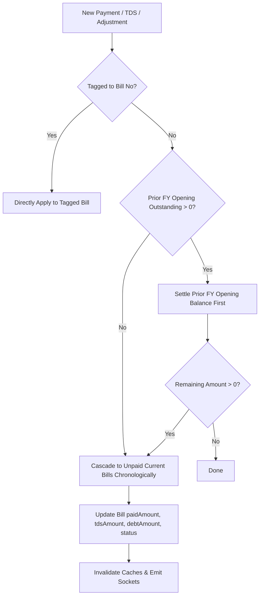
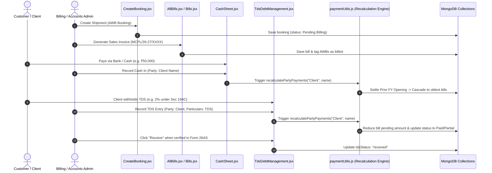

# Multi Marg Carriers - Master Architecture & Agent Operational Guidelines

This document contains mandatory behavioral, architectural, and business logic instructions for all AI agents and engineers working on this repository.

---

## 🏛️ 1. Core Accounting Invariants & Business Logic

### A. Payment & Ledger Calculations
- **Cash In vs Cash Out**:
  - For **Clients**: Cash In adds to total paid, Cash Out subtracts from total paid.
  - For **Vendors**: Cash Out adds to total paid, Cash In subtracts from total paid.
- **TDS (Tax Deducted at Source)**:
  - TDS deducted by clients is a tax credit asset that **directly reduces the customer's outstanding balance**.
  - Net Outstanding Formula:
    $$\text{Net Client Outstanding} = \text{Total Prior/Current Invoiced} - \text{Total Cash/Bank Received} - \text{Total TDS Deducted} - \text{Total Bad Debt/Corrections}$$
  - Net Vendor Outstanding Formula:
    $$\text{Net Vendor Outstanding} = \text{Total Prior/Current Invoiced} - \text{Total Cash/Bank Paid} - \text{Total Vendor TDS} - \text{Total Debit Notes}$$

### B. Payment & TDS Waterfall Cascade Order (`backend/src/utils/paymentUtils.js`)

1. **Direct Tagged Payments & Direct TDS**: Applied directly to the designated `billNo`.
2. **Prior Opening Balance Settlement**: Untagged General Cash and General TDS **FIRST settle the Prior FY Opening Balance** (`openingOutstanding`).
3. **Current Bills Cascade**: Once the Prior FY Opening Balance reaches ₹0, any leftover general cash/TDS cascades sequentially across unpaid **Sales Bills** (Client) or **Purchase Bills** (Vendor) in chronological order.
4. **Permanent Zeroing Rule**:
   - If `totalBilledPrior = 0` or `openingOutstanding = 0`, the system automatically updates `initialOpeningDue = 0` so that subsequent automatic recalculations never resurrect old baseline balances.

### C. Automatic Real-Time Synchronization
- Any mutation (create, update, delete, or restore) in:
  - `cashEntries` (`cashController.js`)
  - `outstanding` (`outstandingController.js`)
  - `openingBalances` (`openingBalanceController.js`)
  - `bills` (`billsController.js`)
  - `purchases` (`purchasesController.js`)
  MUST call `recalculatePartyPayments(partyType, partyName)` to ensure database records and bill statuses (`Paid`, `Partial`, `Unpaid`) are 100% synchronized in real time.
- Global batch recalculation endpoint: `POST /api/outstanding/recalculate-all` and `POST /api/opening-balances/recalculate-all`.

---

## 🔄 2. Complete Workflow Lifecycle

---

## 🎨 3. Frontend & Design Guidelines
- **Modals and Popups**: Always render modals and popups using React Portals (`createPortal`) to ensure they are fixed to the viewport center. Use responsive auto-fit grids so content fits dynamically without requiring vertical scrolling to find or interact with the popup.
- **Date Format**: Always display dates in `DD-MM-YYYY` format globally across the app.
- **Number Formatting**: All amounts should be displayed in Indian number format (e.g. `₹XX,XX,XXX.XX`) using `toLocaleString('en-IN')`.
