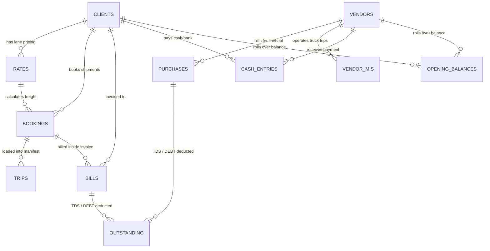
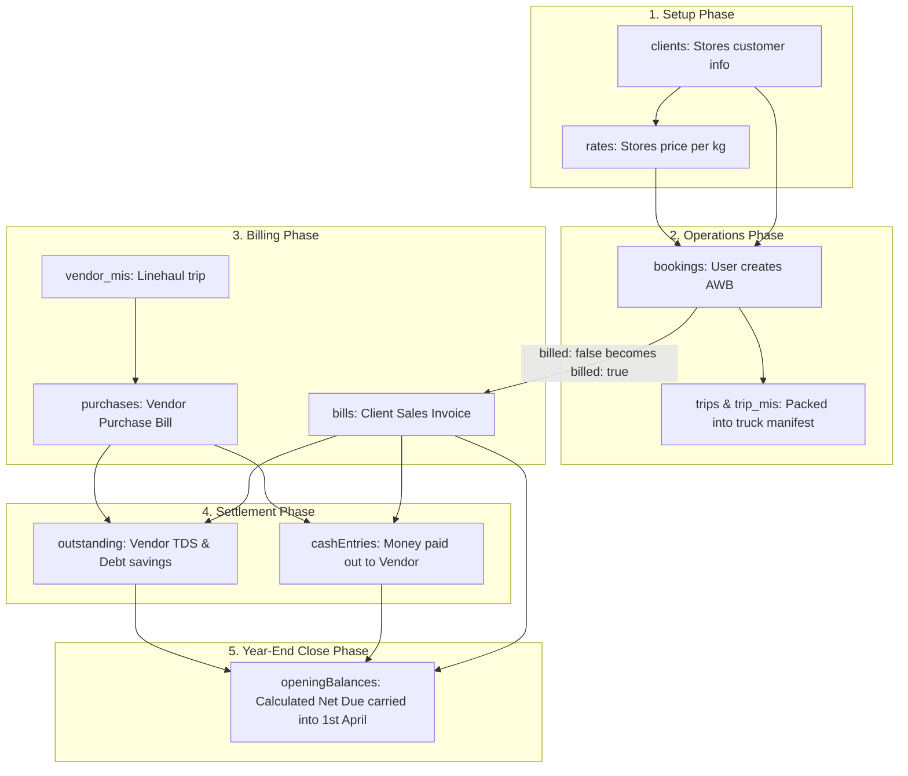
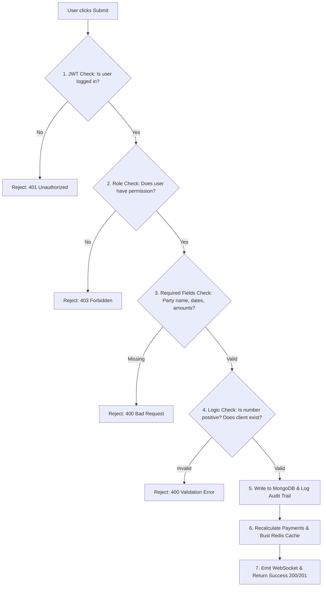

# 🗄️ Database Schemas, Data Flows & Migration Guide

> **💡 The Simple Concept**: Think of MongoDB as a giant digital filing cabinet.
> * Inside this cabinet are different labeled folders called **Collections** (e.g., `bookings`, `bills`, `cashEntries`).
> * Inside each folder are sheets of paper called **Documents** (e.g., one specific AWB shipment or one invoice).
> * On each paper are filled-in boxes called **Fields** (e.g., `awbNo: "MMC-101"`, `weight: 50`).

---

## 🗺️ Visual Entity-Relationship & Data Flow Diagram



---

## 🔄 How Data Moves from Collection to Collection (Lifecycle)



---

## 📦 Detailed Collection Schemas (Explained from Zero)

---

### 1. `bookings` (AWB Consignment Shipments)
* **What is it?**: A single shipment parcel or cargo booked by a customer.
* **Why does it exist?**: To track who sent it, who receives it, how much it weighs, and how much to charge.

| Field Name | Type | What it means | Example |
| :--- | :--- | :--- | :--- |
| `id` | String | Unique ID for this specific document | `"bkg_09a12"` |
| `awbNo` | String | Airway Bill / LR Number on barcode label | `"MMC-100234"` |
| `date` / `dispatch_date` | String | Date shipment was dispatched (YYYY-MM-DD) | `"2026-04-05"` |
| `consignor` | String | Name of the person/company sending parcel | `"ACME INDUSTRIES"` |
| `consignee` | String | Name of the person/company receiving parcel | `"GLOBAL TRADERS"` |
| `client` | String | Which customer pays for this booking | `"SKY 4 LOGISTICS"` |
| `origin` | String | City where parcel starts | `"Delhi"` |
| `destination` | String | City where parcel goes | `"Mumbai"` |
| `mode` | String | How it travels: `Road`, `Train`, `Air`, or `Sea` | `"Road"` |
| `paymentMode` | String | Payment status: `Paid`, `To Pay`, `Credit` | `"Credit"` |
| `total_boxes` | Number | Count of physical packages | `5` |
| `actual_weight` | Number | Weight on the scale in kilograms | `120.5` |
| `charge_wt` | Number | Higher of scale weight vs volume weight | `150.0` |
| `rate` | Number | Price per kilogram | `18.5` |
| `freight` | Number | Basic cost (`charge_wt * rate`) | `2775.0` |
| `pickup` | Number | Doorstep pickup charge | `150.0` |
| `delivery` | Number | Doorstep delivery charge | `200.0` |
| `special` | Number | Special handling charge | `0.0` |
| `other` | Number | Surcharges (docket fee, fuel) | `50.0` |
| `total` | Number | Final bill amount with GST | `3746.5` |
| `billed` | Boolean | `false` = Not yet in an invoice. `true` = Invoiced | `false` |
| `billNo` | String | Invoice number when billed (or null) | `"MMC/26-27/001"` |
| `status` | String | `Booked` $\rightarrow$ `In Transit` $\rightarrow$ `Delivered` $\rightarrow$ `Billed` | `"Booked"` |

---

### 2. `bills` (Client Sales Invoices)
* **What is it?**: A consolidated official GST bill sent to a client for all their shipments during the month.

| Field Name | Type | What it means | Example |
| :--- | :--- | :--- | :--- |
| `id` | String | Unique bill ID | `"bill_882a"` |
| `billNo` / `invoice` | String | Official Invoice Number | `"MMC/26-27/0045"` |
| `date` | String | Invoice Date (YYYY-MM-DD) | `"2026-04-10"` |
| `client` | String | Customer Company Name | `"SKY 4 LOGISTICS"` |
| `taxableAmount` | Number | Total before GST tax | `45000.0` |
| `cgst` | Number | Central GST (9% for intra-state) | `4050.0` |
| `sgst` | Number | State GST (9% for intra-state) | `4050.0` |
| `igst` | Number | Integrated GST (18% for inter-state) | `0.0` |
| `total` | Number | Total amount the client must pay | `53100.0` |
| `paidAmount` | Number | How much the client has paid so far | `50000.0` |
| `status` | String | `Unpaid`, `Partial`, or `Paid` | `"Partial"` |
| `awbList` | Array | Array of AWB numbers included in this bill | `["MMC-100234", "MMC-100235"]` |

---

### 3. `purchases` (Vendor Purchase Bills)
* **What is it?**: A bill from a third-party transporter or vendor who provided transport services.

| Field Name | Type | What it means | Example |
| :--- | :--- | :--- | :--- |
| `id` | String | Unique purchase ID | `"pur_771a"` |
| `vendor` | String | Transporter / Vendor name | `"PRIME ROADWAYS"` |
| `billNo` | String | The vendor's bill number | `"PR/2026/884"` |
| `date` | String | Date of purchase bill | `"2026-04-12"` |
| `total` | Number | Total amount to pay the vendor | `28000.0` |
| `paidAmount` | Number | How much we have paid them so far | `28000.0` |
| `status` | String | `Unpaid`, `Partial`, or `Paid` | `"Paid"` |

---

### 4. `cashEntries` (Cash Sheet & Bank Ledger)
* **What is it?**: The digital passbook for every rupee entering or leaving the company.

| Field Name | Type | What it means | Example |
| :--- | :--- | :--- | :--- |
| `id` | String | Unique transaction ID | `"csh_9921"` |
| `date` | String | Transaction date | `"2026-04-15"` |
| `type` | String | `in` (Money coming in) or `out` (Money going out) | `"in"` |
| `amount` | Number | Amount of money transferred | `50000.0` |
| `partyType` | String | `Client`, `Vendor`, `Driver`, or `Expense` | `"Client"` |
| `partyName` | String | Who paid or who got paid | `"SKY 4 LOGISTICS"` |
| `paymentMode` | String | `Bank`, `Cash`, `Cheque`, or `UPI` | `"Bank"` |
| `bankName` | String | Bank account name | `"HDFC Current A/c"` |
| `billNo` | String | Specific bill cleared (or blank for general) | `"MMC/26-27/0045"` |
| `remarks` | String | Reason / NEFT reference | `"April Part Payment"` |

---

### 5. `outstanding` (TDS & DEBT Deductions)
* **What is it?**: Non-cash adjustments where money is not physically transferred, but deducted for tax (TDS) or penalties (DEBT).

| Field Name | Type | What it means | Example |
| :--- | :--- | :--- | :--- |
| `id` | String | Unique adjustment ID | `"adj_102"` |
| `partyType` | String | `Client` or `Vendor` | `"Client"` |
| `client` / `vendor` | String | Party name | `"SKY 4 LOGISTICS"` |
| `particulars` | String | `tds` (Tax) or `debit`/`debt` (Penalty/Correction) | `"tds"` |
| `amount` | Number | Amount deducted | `900.0` |
| `percentage` | Number | TDS percentage (e.g. 2% under Sec 194C) | `2.0` |
| `date` | String | Date of deduction | `"2026-04-16"` |
| `billNo` | String | Associated invoice number | `"MMC/26-27/0045"` |
| `tdsStatus` | String | `pending` or `received` (verified in Form 26AS) | `"pending"` |

---

### 6. `openingBalances` (Prior Year Balances)
* **What is it?**: The starting reference balance carried over from the prior financial year (as of 31st March) into the new financial year (from 1st April).

| Field Name | Type | What it means | Example |
| :--- | :--- | :--- | :--- |
| `id` | String | Unique opening balance ID | `"opb_01"` |
| `financialYear` | String | Target Year | `"2026-2027"` |
| `asOfDate` | String | Cutoff closing date | `"2026-03-31"` |
| `effectiveFrom` | String | Start date | `"2026-04-01"` |
| `partyType` | String | `Client` or `Vendor` | `"Client"` |
| `partyName` | String | Customer or Vendor name | `"SKY 4 LOGISTICS"` |
| `openingOutstanding`| Number | Net due amount carried forward | `739474.19` |
| `totalBilledPrior` | Number | Total invoiced before 31st March | `6424122.19` |
| `totalPaidPrior` | Number | Total payments received before 31st March | `5684648.00` |
| `totalTdsPrior` | Number | Total TDS deducted before 31st March | `0.00` |
| `totalDebtPrior` | Number | Total DEBT deductions before 31st March | `0.00` |

---

## 🛡️ How Data Checks & Validations Work (Before Saving)

When any user submits a form, the backend performs checks in sequence:



---

## 🛠️ How Data Migrations & Updates Work Under the Hood

### 1. Simple Document Updates (`dbAdapter.js`):
When a document is modified (e.g. updating a booking or bill):
* `db.collection("bills").doc(id).update({ paidAmount: 5000 })`
* **Under the hood**: The adapter transforms this into a MongoDB native `$set` operation and stamps `updatedAt: new Date().toISOString()`.
* Automatically deletes related Redis cache keys so the user sees updated numbers immediately.

### 2. Soft-Delete & Trash Migration:
* When a user deletes a bill or cash entry:
  1. The adapter finds the document in the active collection.
  2. Copies it into the `trash` collection with metadata (`deletedAt`, `deletedBy`, `expiresAt: 30 days`).
  3. Deletes it from the active collection (`deleteOne`).
  4. Automatically recalculates remaining party payments so active balances update.

### 3. Bulk Database Migrations (e.g. `FLIGHT` $\rightarrow$ `AIR`, `RAIL` $\rightarrow$ `TRAIN`):
* A Node migration script loads all documents across `bookings`, `trips`, `trip_mis`, `vendor_mis`, `vendors`.
* Tests each document:
  ```javascript
  if (data.mode === 'FLIGHT') data.mode = 'AIR';
  if (data.mode === 'RAIL') data.mode = 'TRAIN';
  ```
* Writes the updated fields back to MongoDB.
* Flushes the Redis cache to ensure consistency.
