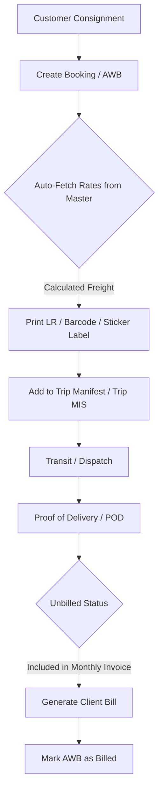
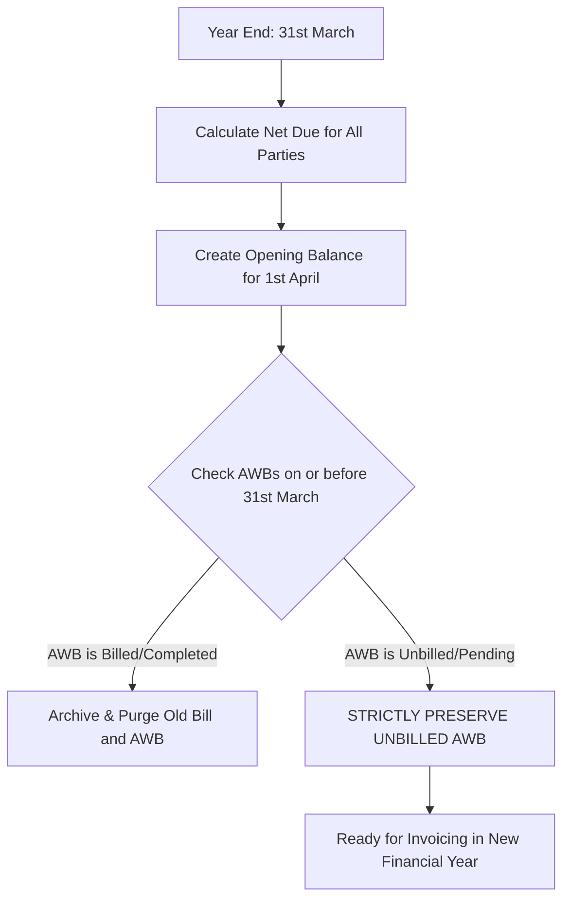

# 🔄 Business Logic, Operational Flows & Accounting Conventions

---

## 1. AWB Booking & Shipment Lifecycle

### Rate Master Calculation Hierarchy:
1. When creating an AWB in `CreateBooking.jsx`, the system queries the `rates` collection by `client`, `origin`, and `destination`.
2. Matching rate card calculates:
   * `Freight = Charged_Weight * Rate_Per_Kg`
   * `Base Total = Freight + Pickup + Delivery + Special + Other`
   * `Grand Total = Base Total + GST (if applicable)`
3. AWB is tagged with mode: `Road`, `Train`, or `Air`.

---

## 2. Manifesting & Trips

* **Trip MIS (`TripMIS.jsx`)**: Manifests multiple LR / AWB consignments into a master vehicle or train/flight manifest with single-click manifest generation (`PrintManifest.jsx`).
* **Vendor MIS (`VendorMIS.jsx`)**: Tracks third-party line-haul trips, vendor vehicle details, driver handover, and transit expenses.

---

## 3. Financial Flows & Invoicing

### Client (Sales) Invoicing (`GenerateBill.jsx` / `AllBills.jsx`):
* Pulls all unbilled AWBs (`billed: false`) for the selected client and date range.
* Generates GST-compliant invoice with CGST, SGST, IGST calculations.
* Marks selected AWBs with `billed: true`, `billNo: invoiceNo`.

### Vendor (Purchase) Invoicing (`Purchase.jsx`):
* Records vendor logistics service bills, line-haul expenses, and vendor GST invoices.

---

## 4. Cash Sheet & Settlement Ledger (`CashSheet.jsx`)

* Records all bank transfers, NEFT/RTGS, UPI, and cash transactions.
* **Cash In (`type: 'in'`)**: Payments received from clients against sales invoices.
* **Cash Out (`type: 'out'`)**: Payments disbursed to vendors, drivers, fuel, and branch expenses.
* **Crucial Rule**: Direct cash transactions and bank payments must ALWAYS be entered via the Cash Sheet.

---

## 5. Dual Point-of-View TDS & DEBT Accounting (`TdsDebtManagement.jsx`)

The system treats TDS and DEBT deductions under two distinct viewpoints:

### A. Client Point-of-View (Sales):
* **TDS Deduction**: Deducted by the client under Section 194C.
  * *Accounting Impact*: Represents an **Income Tax Asset** (claimable 26AS credit).
* **DEBT / Debit Deduction**: Deducted by client for rate dispute, transit delay, or shortage.
  * *Accounting Impact*: Written-off revenue loss.
* **Net Client Outstanding Calculation**:
  $$\text{Net Client Due} = \text{Total Invoiced} - \text{Cash/Bank Received} - \text{Client TDS} - \text{Client DEBT}$$

### B. Vendor Point-of-View (Purchases):
* **TDS Deduction**: Deducted by Multi Marg from vendor payments.
  * *Accounting Impact*: Represents **Tax Payable to Govt** on vendor's behalf.
* **DEBT / Debit Deduction**: Multi Marg deducts charges from vendor for penalty or diesel advance.
  * *Accounting Impact*: Direct **Cost Savings / Margin Profit**.
* **Net Vendor Outstanding Calculation**:
  $$\text{Net Vendor Due} = \text{Total Vendor Bills} - \text{Payments Paid} - \text{Vendor TDS} - \text{Vendor DEBT}$$

---

## 6. Financial Year End Close & Prior FY Opening Outstandings (`OpeningOutstanding.jsx`)

### Key Year-End Close Rules:
1. **Zero Loss of Balance**: Net closing balance as of 31st March is rolled over into `openingBalances` as the reference opening balance from 1st April.
2. **Purging Old Bills**: Completed sales invoices and vendor purchase bills on or before 31st March are archived to clean the active list.
3. **Strict Preservation of Unbilled AWBs**: If an AWB dated $\le$ 31st March has **NOT** been billed, it is **never purged**. It remains available in Generate Bill for new financial year billing.
