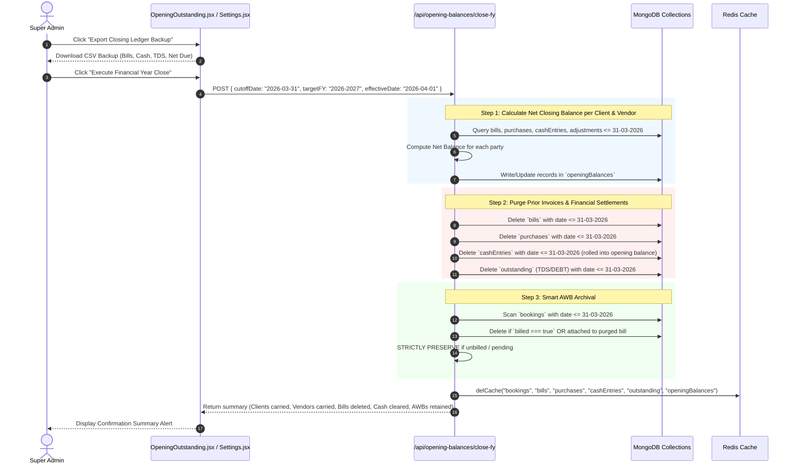

# 🔄 End-to-End Business Logic, Data Pipelines & Mathematical Calculations

This document is the **definitive operational and mathematical handbook** for Multi Marg Carriers ERP. It details how data enters the system, how calculations are derived step-by-step, how data flows between collections, and how the entire accounting lifecycle operates.

---

## 🧭 Master System Data Flow Pipeline

```
[1. Rate Master] ──> Configures rates per kg, pickup, delivery for (Client + Origin + Destination + Mode)
       │
       ▼
[2. Create Booking] ──> Generates AWB/LR in `bookings` (Calculates Ch.Weight, Freight, Subtotal, GST, Total)
       │
       ├─────────────────────────────────────────┐
       ▼                                         ▼
[3. Trip MIS / Manifest]                  [4. Client Invoicing (Generate Bill)]
   - Groups AWBs into trips in `trip_mis`     - Pulls unbilled AWBs (`billed: false`) from `bookings`
   - Manifest printed (`PrintManifest.jsx`)    - Creates Invoice in `bills` & marks AWBs as `billed: true`
       │                                         │
       ▼                                         ▼
[5. Vendor MIS / Purchase]                [6. Cash Sheet / Settlement]
   - Records Linehaul in `vendor_mis`        - Records receipts from clients (`type: 'in'`)
   - Records vendor bills in `purchases`     - Records disbursements to vendors (`type: 'out'`)
       │                                         │
       └────────────────────┬────────────────────┘
                            │
                            ▼
               [7. TDS & DEBT Adjustments (`outstanding`)]
                  - Client: 26AS Tax Asset & Written-off Losses
                  - Vendor: Tax Withholding Liability & Deductions Profit
                            │
                            ▼
               [8. Net Outstanding Calculation Engine]
                  - Client Due = Invoiced - Paid - TDS - DEBT
                  - Vendor Due = Invoiced - Paid - TDS - DEBT
                            │
                            ▼
               [9. Financial Year End Close & Archival]
                  - Net Balance saved to `openingBalances` for 1st April
                  - Purges completed bills & billed AWBs
                  - Strictly preserves unbilled AWBs
```

---

## 🧮 1. Step-by-Step Mathematical Calculations

### A. Chargeable Weight Calculation
Logistics pricing uses the higher of physical weight and volumetric weight:

$$\text{Volumetric Weight (KG)} = \frac{\text{Length (cm)} \times \text{Width (cm)} \times \text{Height (cm)} \times \text{Total Boxes}}{\text{Volumetric Factor (e.g. 5000 / 6000 / 2700 for CFT)}}$$

$$\text{Chargeable Weight} = \max(\text{Actual Physical Weight}, \text{Volumetric Weight})$$

---

### B. AWB Booking Freight & Total Calculation (`CreateBooking.jsx`)
1. **Fetch Rate Card**: The system matches the client rate card based on `(Client Name, Origin, Destination, Mode)`:
   * **Mode**: `Road`, `Train`, or `Air`.
   * **Base Rate**: `rate.roadRate`, `rate.trainRate`, or `rate.airRate`.
   * **Pickup Charge**: `rate.roadPickup`, `rate.trainPickup`, or `rate.airPickup`.
   * **Delivery Charge**: `rate.roadDelivery`, `rate.trainDelivery`, or `rate.airDelivery`.

2. **Calculate Freight**:
   $$\text{Base Freight} = \text{Chargeable Weight} \times \text{Rate Per KG}$$

3. **Calculate Subtotal (Taxable Amount)**:
   $$\text{Taxable Subtotal} = \text{Base Freight} + \text{Pickup} + \text{Delivery} + \text{Special Charges} + \text{Other Charges} + \text{Parking} + \text{Labor}$$

4. **GST Tax Calculation**:
   * If both Consignor and Consignee or billing states match:
     $$\text{CGST (9\%)} = \text{Taxable Subtotal} \times 0.09$$
     $$\text{SGST (9\%)} = \text{Taxable Subtotal} \times 0.09$$
     $$\text{IGST} = 0$$
   * If interstate shipment:
     $$\text{IGST (18\%)} = \text{Taxable Subtotal} \times 0.18$$
     $$\text{CGST} = 0, \quad \text{SGST} = 0$$

5. **Grand Total**:
   $$\text{AWB Total} = \text{Taxable Subtotal} + \text{CGST} + \text{SGST} + \text{IGST}$$

---

### C. Client Sales Invoicing (`GenerateBill.jsx` / `AllBills.jsx`)
1. User filters unbilled bookings by `Client` and `Date Range (From - To)`.
2. System retrieves bookings matching `client == selectedClient` AND `billed !== true`.
3. Summation:
   $$\text{Invoice Taxable Total} = \sum_{i=1}^{N} \text{Taxable Subtotal of Booking } i$$
   $$\text{Total CGST} = \sum \text{CGST}_i, \quad \text{Total SGST} = \sum \text{SGST}_i, \quad \text{Total IGST} = \sum \text{IGST}_i$$
   $$\text{Invoice Grand Total} = \text{Invoice Taxable Total} + \text{Total CGST} + \text{Total SGST} + \text{Total IGST}$$
4. Document created in `bills` collection with `billNo: "MMC/26-27/001"`.
5. All $N$ selected bookings in `bookings` collection updated with:
   * `billed = true`
   * `billNo = "MMC/26-27/001"`
   * `status = "Billed"`

---

### D. Cash Sheet Settlements (`CashSheet.jsx`)
All physical and electronic money transfers are logged in `cashEntries`:
* **Client Receipts (`type: 'in'`)**:
  * Added to client paid total.
* **Vendor Disbursements (`type: 'out'`)**:
  * Added to vendor paid total.
* **Reversals / Bounces (`type: 'in'` for vendor or `type: 'out'` for client)**:
  * Subtracted accordingly to maintain exact bank balance parity.

---

### E. TDS & DEBT Adjustments (`TdsDebtManagement.jsx`)

#### 1. Client Adjustments (Sales Point of View):
* **Client TDS (Tax Deducted at Source by Client)**:
  * Client pays invoice less 2% or 1% TDS under Section 194C.
  * Form saves entry with `partyType: "Client"`, `particulars: "tds"`, `amount: X`.
  * *Meaning*: Tax credit asset in Form 26AS.
* **Client DEBT (Debit note / Deduction by Client)**:
  * Client penalizes or deducts for late delivery, damage, or rate correction.
  * Form saves entry with `partyType: "Client"`, `particulars: "debit"` / `"debt"`, `amount: Y`.
  * *Meaning*: Written-off loss.
* **Net Client Receivable Formula**:
  $$\text{Net Client Outstanding} = \text{Total Prior/Current Billed} - \text{Total Cash In} - \text{Total Client TDS} - \text{Total Client DEBT}$$

#### 2. Vendor Adjustments (Purchase Point of View):
* **Vendor TDS (Tax Withheld from Vendor Payment)**:
  * Multi Marg pays vendor bill less 1% / 2% TDS.
  * Form saves entry with `partyType: "Vendor"`, `particulars: "tds"`, `amount: X`.
  * *Meaning*: Tax liability that Multi Marg deposits to the Government on the vendor's behalf.
* **Vendor DEBT (Debit note / Deduction from Vendor)**:
  * Multi Marg deducts charges from vendor for trip breakdown, missing freight, or advance fuel deduction.
  * Form saves entry with `partyType: "Vendor"`, `particulars: "debit"` / `"debt"`, `amount: Y`.
  * *Meaning*: Margin cost savings / Profit for Multi Marg.
* **Net Vendor Payable Formula**:
  $$\text{Net Vendor Outstanding} = \text{Total Vendor Invoices} - \text{Total Cash Out Paid} - \text{Total Vendor TDS} - \text{Total Vendor DEBT}$$

---

## 🏛️ 2. Step-by-Step Financial Year End Closing Flow



---

## 🔒 3. Invariants & Data Integrity Rules

1. **Unbilled AWB Immutability During FY Close**:
   Under no circumstances may an unbilled booking be deleted by an archival routine. If an AWB has no invoice attached, it belongs to active revenue work-in-progress and must be carried over into the new year.

2. **Cash Inflow / Outflow Exclusivity**:
   Actual bank or cash currency movements must strictly reside in `cashEntries`. TDS and DEBT deductions must strictly reside in `outstanding`. The Outstanding page must never accept direct bank/cash inputs.

3. **Standardized Transit Modes**:
   The entire system enforces 3 valid modes:
   * `Road` (`ROAD`)
   * `Train` (`TRAIN`)
   * `Air` (`AIR`)
   Legacy terms (`Flight`, `Rail`, `Surface`, `Express`) are permanently mapped and converted.
